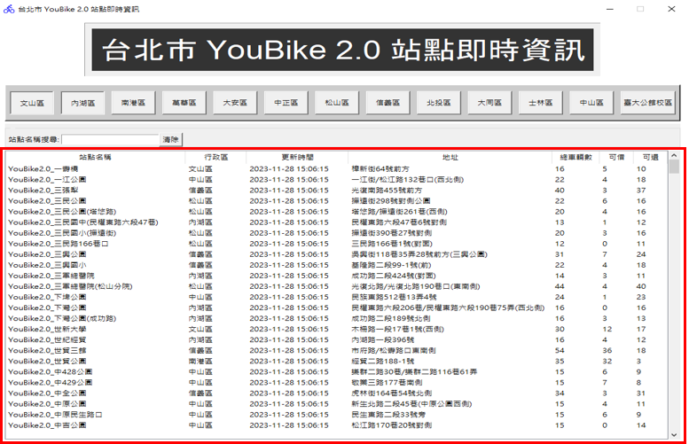
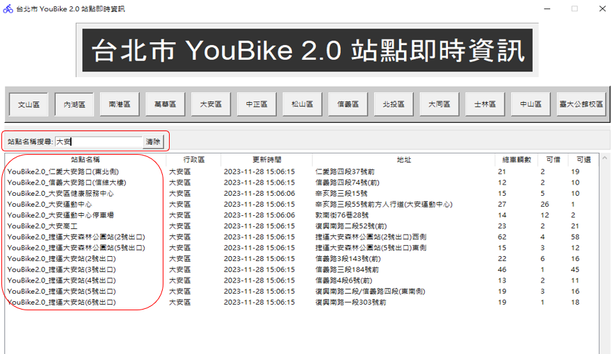
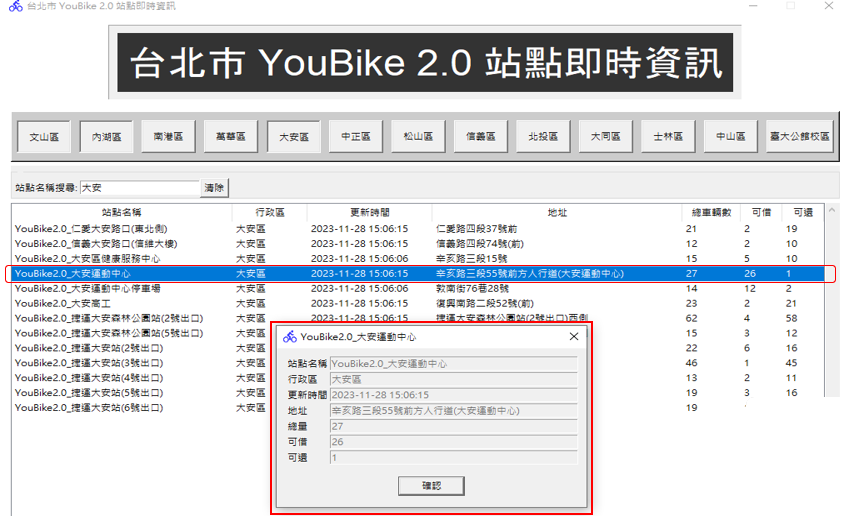
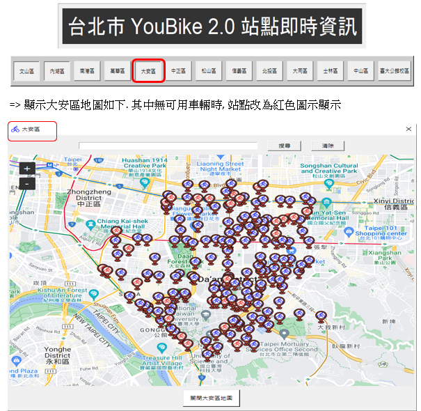
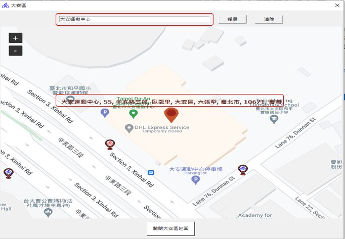

# 專題-台北市 YouBike 2.0 站點即時資訊
## 組員有：張盛枋、劉峻宏、陳建任

說明:
透過下載台北市youbike資料2.0
(https://tcgbusfs.blob.core.windows.net/dotapp/youbike/v2/youbike_immediate.json)
建立Sqlite 資料庫 “台北市youbike.db”, 及建立視窗介面顯示台北市 YouBike 2.0 站點即時資訊

# (1) 主畫面: 台北市 YouBike 2.0 站點即時資訊 (全部行政區)

# (2) 站點名稱搜尋. 例如: 大安

# (3) 個別站點詳細資料顯示. 例如: 直接點選”大安運動中心”

# (4) 點選行政區顯示YouBike地圖. 例如: 大安區

# (5) YouBike地圖詳細站點資訊搜尋. 例如: 大安運動中心

註:使用工具套件如下
tkinter
requests
sqlite3
os
PIL